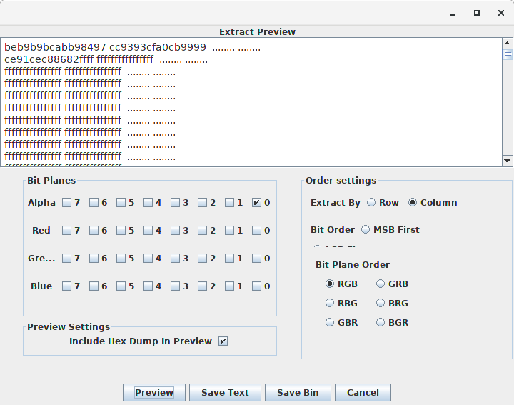
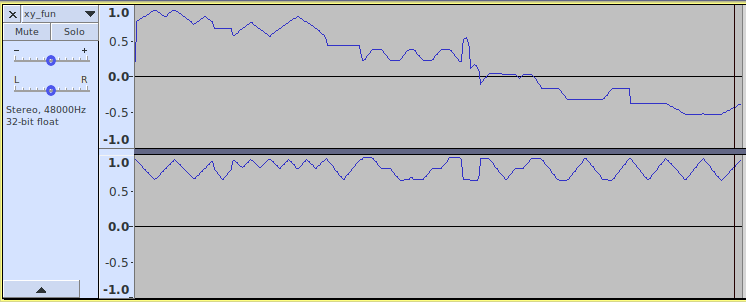
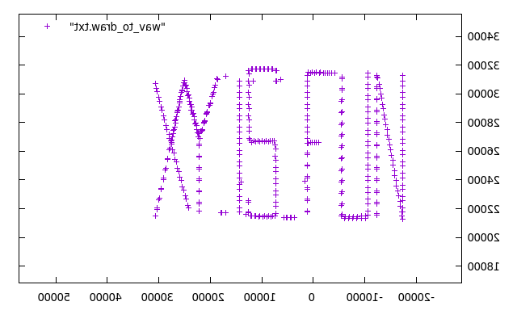
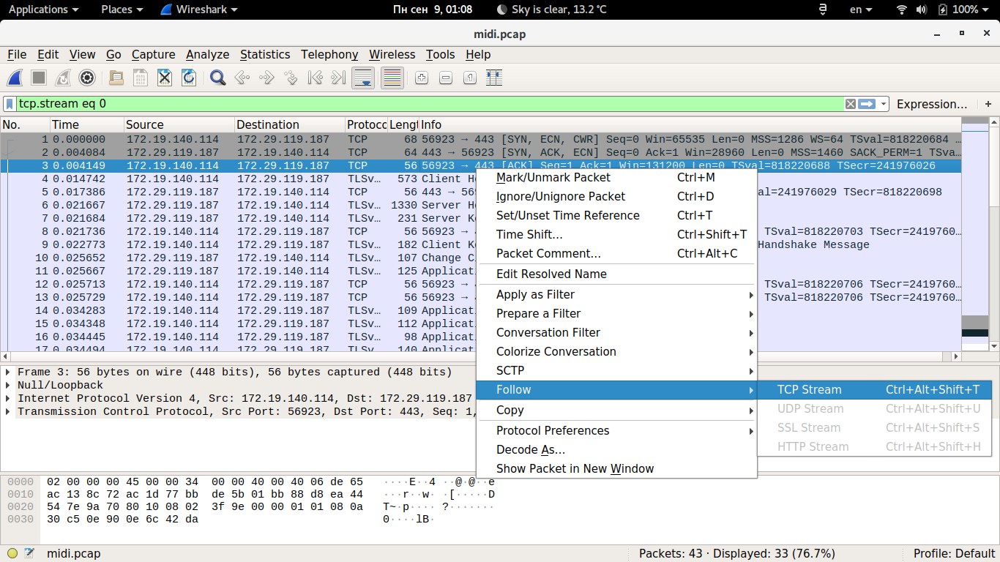
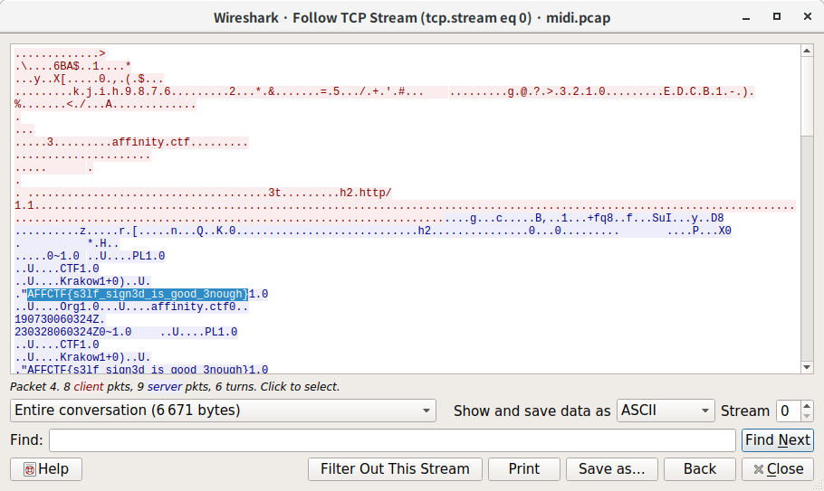
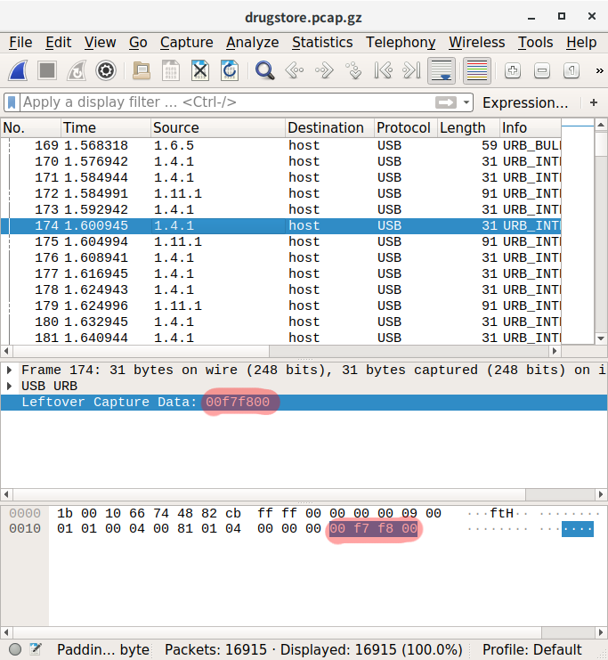
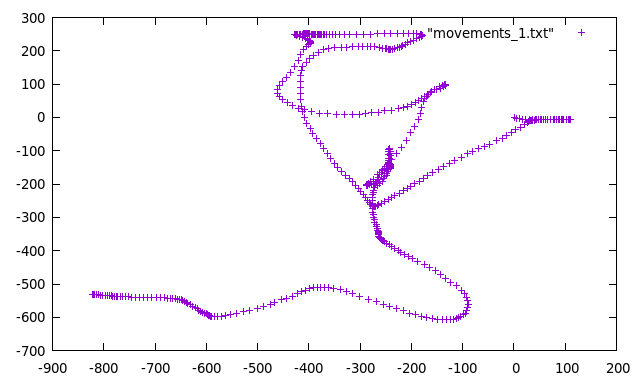
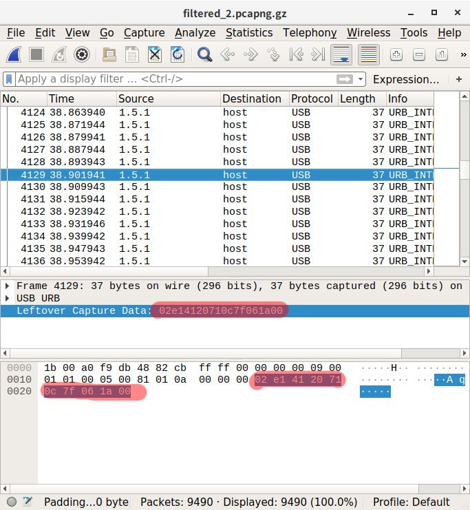
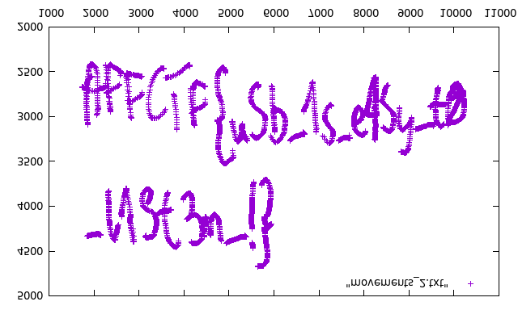

# AffinityCTF2019-Quals writeup
# Prepared by e.g. team

## 1. BreakingBad (crypto, 150)

HoRfSbMtInMcLvFlAcAmInMcAmTeErFmInHoLvDbRnMd

Note: put flag into AFFCTF{} format.

### Solution:

From the task name it's quite obvious that the given string contains the chemical elements from the Mendeleev's table. And the only thing that can represent some hidden data is the atomic number.
Lets decode it:

```
Ho - 67
Rf - 104
Sb - 51
Mt - 109
In - 49
Mc - 115
Lv - 116
Fl - 114
Ac - 89
Am - 95
In - 49
Mc - 115
Am - 95
Te - 52
Er - 68
Fm - 100
In - 49
Ho - 67
Lv - 116
Db - 105
Rn - 86
Md - 101
```
Converted to ASCII: ```Ch3m1strY_1s_4Dd1CtiVe```

Flag: ```AFFCTF{Ch3m1strY_1s_4Dd1CtiVe}```

## 2. Stegoego (stego, 150)


### Solution:

The most common tool for this type of challenges is Stegsolve, but this time, I simply saw the stereogram, trust me :D

The flag is ```AFFCTF{Defence123}```

## 3. Alphinity (stego, 300)

Welcome!


### Solution:

First I always try to change brightness and contrast, but it didn't help here.
The challenge name sounds close to ALPHinity.. alpha.. alpha-channel.
Ok, let's try to extract the data from it with Stegsolve.

After a few attempts I got this:



```be b9 b9 bc ab b9 84 97 cc 93 93 cf a0 cb 99 99 ce 91 ce c8 86 82```

Looks structured but still unreadable. We know that the flag format is AFFCTF{...}. The second and the third bytes are equal, so it should be some kind of constant shift (not constant as appeared to be).
Maybe there is another, more smart solution, but I counted shift like this:

```
def getChr(byte):
  return chr(int('be',16) + (ord('A') - int(byte,16)))
```

I simply passed every byte to this function and recovered the flag symbol by symbol: ```AFFCTF{h3ll0_4ff1n1n17y}```

## 4. XY_FUN (stego, 300)

Note: put flag into AFFCTF{} format


### Solution:

Nothing interesting in Audacity:



But the task name sounds like xy_fun... function... y(x)..
Ok, what if we try to plot the image considering audio samples as coordinates?
WAV is an uncompressed format, so the audio samples performed simply as numbers:

```wav file = [44 byte wav header][raw audio samples...]```

where

```[raw audio samples] = [LRLRLRLRLRLR...]```.

L and R are numbers for left and right channels respectively.

Let's write python script to extract the samples:

```
import struct
b = open('xy_fun.wav', 'rb').read()[44:] #omit first 44 bytes
raw_bytes = [struct.unpack('h', ''.join(b[i : i+2]))[0] for i in xrange(0,len(b), 2)]
with open('wav_to_draw.txt', 'w') as file:
	i = 0
	while i < len(raw_bytes):
		file.write(str(raw_bytes[i]) + ' ' + str(raw_bytes[i+1]) + '\n')
		i+=2
```

Now ```wav_to_draw.txt``` file looks like this:

```
6333 31004
25467 30273
25873 29579
...   ...
```

Let's plot it! I used gnuplot for this.

```
$ gnuplot

  G N U P L O T
  Version 5.2 patchlevel 2    last modified 2017-11-01 

  Copyright (C) 1986-1993, 1998, 2004, 2007-2017
  Thomas Williams, Colin Kelley and many others

  gnuplot home:     http://www.gnuplot.info
  faq, bugs, etc:   type "help FAQ"
  immediate help:   type "help"  (plot window: hit 'h')

gnuplot> plot "wav_to_draw.txt"
```
The output image was mirrored. Afted mirroring it back I finally got this:



And the flag is: ```AFFCTF{XY_1S_FUN}```

## 5. MIDI 1 (misc, 50)

plaintext plaintext everywhere....


### Solution:

Let's open the attached file with Wireshark:



We see some intercepted traffic, so, the first thing to do is simply to follow the stream :)



Yeah!! Pretty easy. The flag is: ```AFFCTF{s3lf_sign3d_is_good_3nough}```

## 6. Pharmacist Nightmare (forensics, 300)

Our malware intercepted traffic from one of drugstore computers. Can you find prescription?


### Solution:

Let's open the file in Wireshark:


We see some unusual traffic here... some URB_BULK in, URB_BULK out, URB_INTERRUPT... wtf?
After some googling I found that it is an intercepted USB traffic (as said in "Protocol" column) from multiple usb devices.
"host" is a computer to which all these devices were plugged in and the different sources stand for the different devices. We can simply filter the packets with source "host", because they only represent a response and have no useful information.
Packet length is different for every device => we need to find, which device produces the traffic with potential flag
We can distinguish the following "addresses":
```
source		percent of all packets
1.3.1		(0.1%)
1.4.1		(3.0%)
1.5.1		(56.1%)
1.6.4		(0.1%)
1.6.5		(6.3%)
1.11.0		(0.2%)
1.11.1		(25.4%)
1.11.2		(2.0%)
```

If we look at Leftover Capture Data for packets with source 1.4.1, we will see the following:



Here: https://www.rootusers.com/google-ctf-2016-forensic-for2-write-up/ I found that this 4-byte code represents mouse movements (2nd byte - X, 3rd byte - Y) in hex values. Looks like the flag can be there!

Filter needed packets in Wireshark: ```usb.src == "1.4.1"```

Extract needed data using ```tshark```:
```
$ tshark -r filtered_1.pcapng -T fields -e usb.capdata -Y usb.capdata > extracted_1.txt
$ tail -n 10 extracted_1.txt 
00:fd:01:00
00:fd:00:00
00:fd:01:00
00:fc:00:00
00:fc:00:00
00:fc:01:00
00:fb:01:00
00:fb:00:00
00:fd:01:00
00:fc:00:00
```
Parse values to get integer X and Y movements:
```
contents = open('extracted_1.txt', 'r').readlines()
contents_2 = []
for item in contents:
	contents_2.append( [item[3:5], item[6:8]] )

def parse_move(value):
	if int(value, 16) > 127:
		return int(value, 16) - 256
	else:
		return int(value, 16)

x,y = 0, 0 # mouse position default values

with open('movements_1.txt', 'w') as file:
	for item in contents_2:
		x += parse_move(item[0])
		y += parse_move(item[1])
		file.write(str(x) + ' ' + str(y) + '\n')
```
Last 10 lines of movements_1.txt:
```
$ tail -n 10 movements_1.txt 
-818 -533
-819 -533
-819 -532
-820 -532
-821 -532
-821 -531
-822 -531
-823 -531
-823 -531
-823 -531
```
Plot these values:
```
$ gnuplot
gnuplot> plot "movements_1.txt"
```



Well, nothing interesting...

What about source 1.5.1, the majority of the packets in the given file?

Filter: ```usb.src = "1.5.1"```



I found this very useful writeup: https://blogs.tunelko.com/2017/02/05/bitsctf-tom-and-jerry-50-points/
This situation is a bit different, but looks very similar. 
We have 10 bytes data: ```02 e1 41 20 71 0c 7f 06 1a 00```, which can be interpreted as:
```
02 e1 - header
41 20 - X
71 0c - Y
7f 06 - pressure
1a 00 - suffix
```
Obviously we are dealing with some kind of drawing tablet.
Extract data from intercepted traffic:
```
$ tshark -r filtered_2.pcapng -T fields -e usb.capdata -Y usb.capdata > extracted_2.txt
$ head -n 20 extracted_2.txt 
c0:00:00:00:00:00:00:00:00:01
c0:00:00:00:00:00:00:00:00:01
02:80:00:00:00:00:00:00:00:00
02:80:00:00:00:00:00:00:00:00
02:80:00:00:00:00:00:00:00:00
02:80:00:00:00:00:00:00:00:00
02:80:00:00:00:00:00:00:00:00
02:80:00:00:00:00:00:00:00:00
02:80:00:00:00:00:00:00:00:00
02:80:00:00:00:00:00:00:00:00
02:c0:00:00:dc:02:00:00:0c:00
02:e0:00:00:e4:02:00:00:0c:00
02:e0:00:00:f9:02:00:00:0d:00
02:e0:00:00:f1:02:00:00:0d:00
02:e0:00:00:fa:02:00:00:0d:00
02:e0:00:00:f9:02:00:00:0d:00
02:e0:00:00:f9:02:00:00:0d:00
02:e0:00:00:fe:02:00:00:0d:00
02:e0:00:00:fd:02:00:00:0d:00
02:e0:00:00:f9:02:00:00:0d:00
```
Then I used commands from the aforementioned writeup, and modified them a bit:

Parse strings:
```
$ awk -F: '{x=$3$4;y=$5$6}{z=$7}$1=="02"{print x,y,z}' extracted_2.txt > hex_movements.txt
```
Parse hex movements (```solve.py```):
```
from pwn import *
for i in open('hex_movements.txt').readlines():
    ii = i.strip().split(' ')
    x = int(ii[0], 16)
    y = int(ii[1], 16)
    z = int(ii[2], 16)
    if z > 0:
	print u16(struct.pack(">H", x)), u16(struct.pack(">H", y))
```

Final steps:
```
$ python solve.py > movements_2.txt
$ gnuplot
gnuplot> plot "movements_2.txt"
```
The image was mirrored, after mirroring it back finally I got the flag:



```AFFCTF{uSb_1s_e4Sy_t0_l1St3n_!}```
